# Bookmark and url shortening Application 

## Introduction

This is a full stack application developed using Angular7,Typescript as Frontend,OpenJdk11 as Backend and Database with Inmemory.

The Aim of the Application would serve as Bookmark Management of your external urls. where you can generate tiny urls this tiny url will refer to the external url. where you can share your tiny url around organization and you can also redirect to external urls.

This Application has the ability to generate a card representation of your tiny urls and you can manage those cards by update and delete operation. In this
application you can also create a group like team names under differenet categories like Tribe,platform,application and manage those cards by promoting a user as admin.
  
## Technology stack

* Backend
    - Language: Java OpenJDK 11
    - Framework: spring-boot
* Frontend
    - Language: Typescript
    - Framework: Angular
* Database
    - Inmemory
* Monitoring
    - ELK

## Architecture
   
   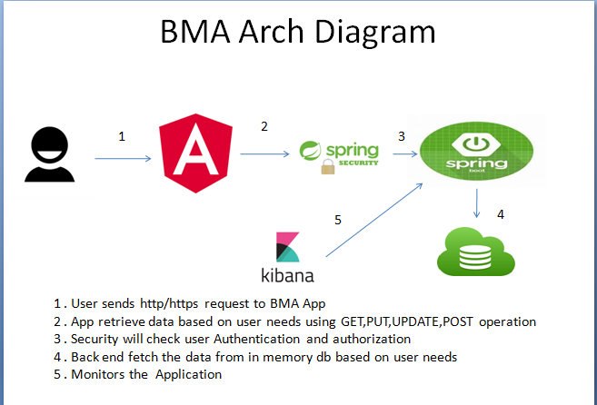
   
## DB-ER
	
   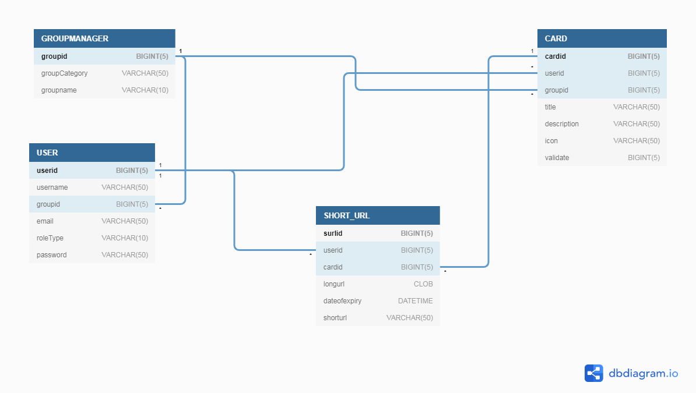

## CI\CD
###Frontend

   
   
###Backend 
     
   
   
   
      
   
## Build And Deploy

### Prerequisite

   |    software           |            Link               |
   |:---------------------:|:-----------------------------:|
   |   openJDk11           | https://openjdk.java.net/install/ |
   |   nodejs              | https://nodejs.org/en/download/current/ |
   |   angularcli          | https://cli.angular.io/ |
   |   maven               | https://maven.apache.org/install.html |

    --  Above software to be installed in your system   	

### Running In Locally

- step1 Download the zip or clone the repository bma-app-frontend and bma-app-backend from github to your local by using **git clone <repo name>** and you should able to see message as shown in below image

   
   
- step2 Unzip the zip file (if you downloaded one)
 
- step3 navigate into bma-app-frontend directory and open terminal run **ng serve** and you should able to see message as shown in below image

   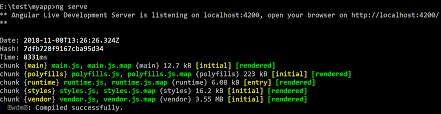
   
- step4 You are all Set open browser hit **http://localhost:4200/** you should able to see home page of Application as shown in below image

   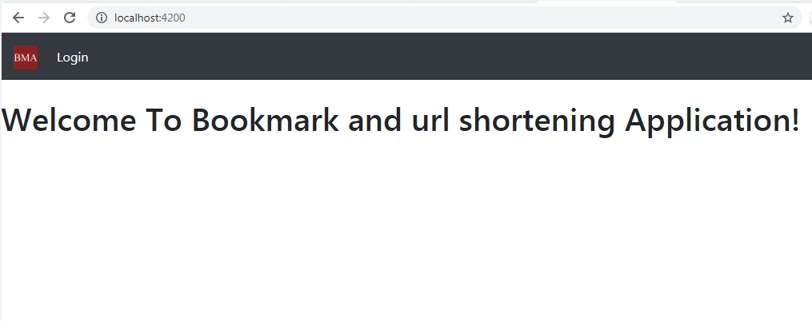
   
- step5 navigate into bma-app-backend directory and open terminal run **mvn clean install** and you should able to see message as shown in below image

   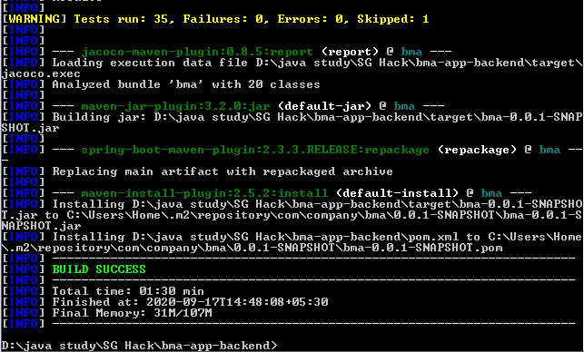
   
- step6 navigate into target directory under bma-app-backend open terminal run **java -jar -Dspring.profiles.active=dev <jarname>**

   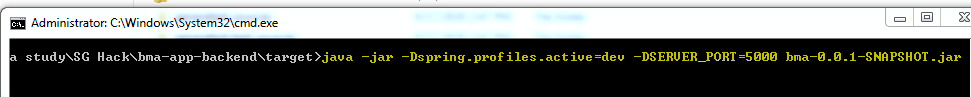
   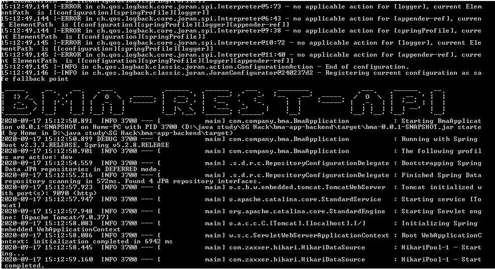
   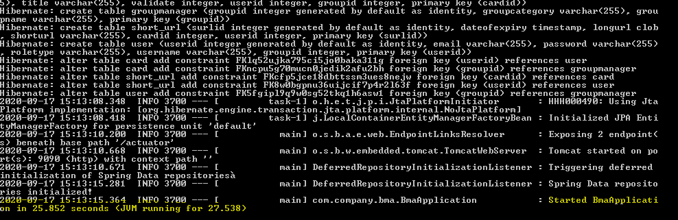
   
- step7 You are all Set open browser open browser hit **http://localhost:9090/swagger-ui.html**

### Testing with Openapi

- step1 open your browser and type **http://localhost:9090/swagger-ui.html** and you should able to see message as shown in below image

   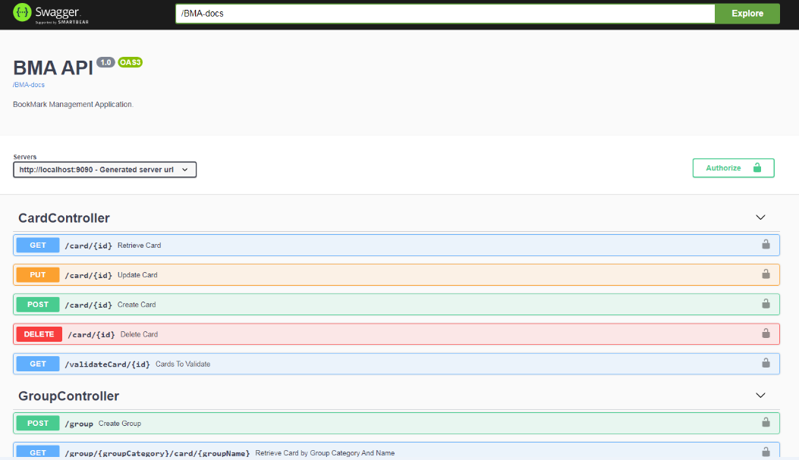
   
- step2 create a user by click /user post api and provide user details as shown below
		   
   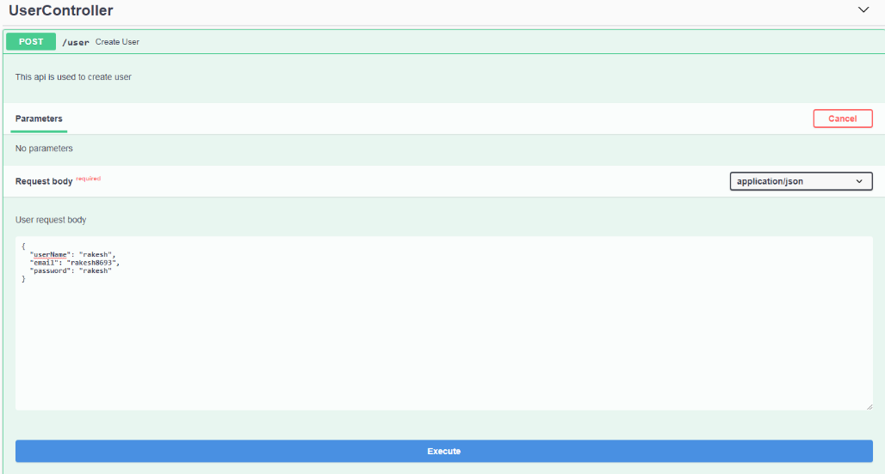
   
- step3 click on the execute button and you should able to see response as shown below
		   
   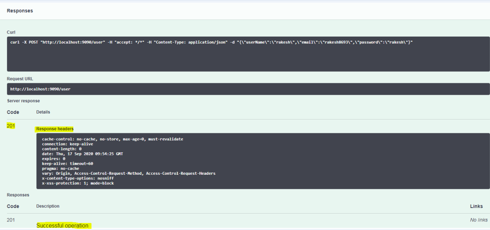
   
- step4 give the created user name and password in the Authorization lock of other apis as shown below
		   
   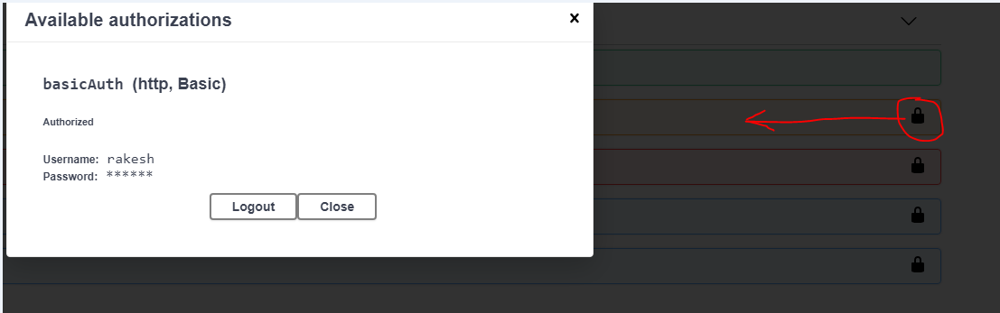
   
- step5 You are all Set to play with other api.		   
         

## Todo

Kibana Monitoring And Deploy to cloud Heroku or AWS or Azure.    

## Contacts

Drop a mail to rakesh8693@gmail.com
